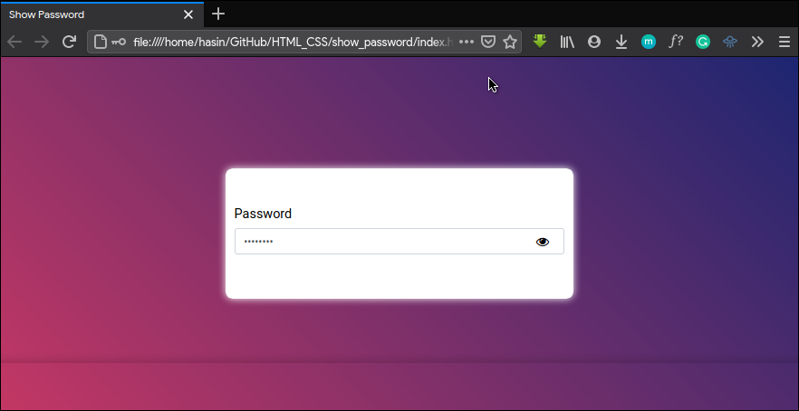

## View Password Input

The input tag with `type="password"` that has the functionality to show and hide the password using Vanilla JavaScript only.

Please visit https://sam0132nodier.github.io/show-password-using-VanillaJS/

This project can be implemented by anyone who is trying to create an accessible password input.

Feel free to implement it in your own projects.